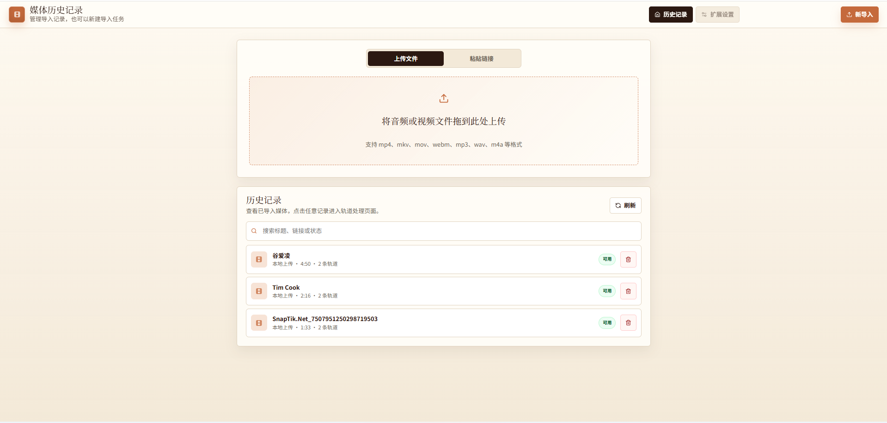
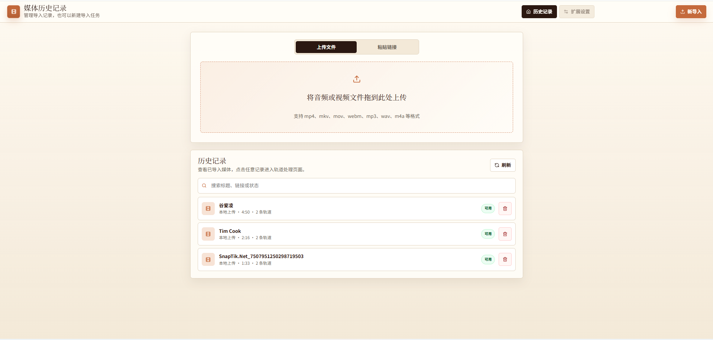

# TrackExtract 🎬

TrackExtract 是一个基于真实媒体工具链的视频处理 Web 应用，用来提取视频、音频、字幕轨，并支持 Whisper 字幕生成与字幕片段编辑。

## 界面预览 🖼️

### 媒体导入



### 媒体历史记录



## 功能亮点 ✨

- 上传本地视频/音频，或通过 URL 导入在线媒体
- 使用 `ffprobe` 检测真实媒体轨道信息
- 使用 `ffmpeg` 导出视频轨、音频轨、字幕轨
- 使用 `faster-whisper` 在没有字幕时生成 SRT/VTT
- 在线编辑字幕片段，支持保存版本与重新导出
- Docker Compose 一键启动 MySQL、Redis、后端、Worker 和前端

## 技术栈 🧰

- Backend: FastAPI, SQLAlchemy, Celery
- Worker: Celery + Redis
- Database: MySQL
- Media: FFmpeg, FFprobe, yt-dlp, faster-whisper
- Frontend: React, TypeScript, Vite
- Runtime: Docker Compose

## Docker 镜像名 🐳

`docker-compose.yml` 中的项目镜像名：

- `russelleekok/trackextract-backend:latest`
- `russelleekok/trackextract-worker:latest`
- `russelleekok/trackextract-frontend:latest`

MySQL 和 Redis 使用官方镜像。

## 快速开始 🚀

1. 复制环境变量文件：

```bash
cp .env.example .env
```

2. 启动服务：

```bash
docker compose up --build
```

3. 打开应用：

- 前端: http://localhost:5173
- 后端 API 文档: http://localhost:8000/docs

## 环境变量 ⚙️

主要配置在 `.env.example` 中：

- `DATABASE_URL`: 后端连接 MySQL 的地址
- `REDIS_URL`: Celery/Redis 地址
- `STORAGE_ROOT`: 媒体文件存储目录
- `WHISPER_MODEL_SIZE`: Whisper 模型大小，默认 `small`
- `WHISPER_DEVICE`: Whisper 运行设备，默认 `cpu`
- `WHISPER_COMPUTE_TYPE`: Whisper 计算类型，默认 `int8`
- `BACKEND_CORS_ORIGINS`: 允许访问后端的前端地址

## 本地开发 🛠️

前端：

```bash
cd frontend
npm install
npm run dev
```

后端通常建议通过 Docker Compose 启动，因为它依赖 MySQL、Redis、FFmpeg 和 Whisper 相关环境。

## 注意事项 📌

- 项目不使用 mock 媒体数据，轨道信息来自真实的 `yt-dlp`、`ffprobe`、`ffmpeg` 和 `faster-whisper`。
- 在线媒体导入取决于 `yt-dlp` 是否能合法访问目标 URL。
- 原始导出文件会保留，字幕编辑会保存为新的字幕版本。
- Whisper 首次运行可能需要下载模型，耗时取决于网络和模型大小。
